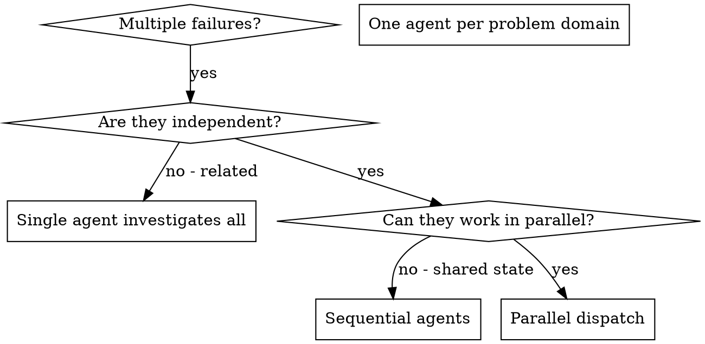

# Dispatching Parallel Agents

## Overview

You delegate tasks to specialized agents with isolated context. By precisely crafting their instructions and context, you ensure they stay focused and succeed at their task. They should never inherit your session's context or history — you construct exactly what they need. This also preserves your own context for coordination work.

When you have multiple unrelated failures (different test files, different subsystems, different bugs), investigating them sequentially wastes time. Each investigation is independent and can happen in parallel.

**Core principle:** Dispatch one agent per independent problem domain. Let them work concurrently.

## When to Use



**Use when:**
- 3+ test files failing with different root causes
- Multiple subsystems broken independently
- Each problem can be understood without context from others
- No shared state between investigations

**Don't use when:**
- Failures are related (fix one might fix others)
- Need to understand full system state
- Agents would interfere with each other

## The Pattern

### 1. Identify Independent Domains

Group failures by what's broken:
- File A tests: Tool approval flow
- File B tests: Batch completion behavior
- File C tests: Abort functionality

Each domain is independent - fixing tool approval doesn't affect abort tests.

### 2. Create Focused Agent Tasks

Each agent gets:
- **Specific scope:** One test file or subsystem
- **Clear goal:** Make these tests pass
- **Constraints:** Don't change other code
- **Expected output:** Summary of what you found and fixed

### 3. Dispatch in Parallel

Use `call_omo_agent` with `run_in_background=true` to dispatch background tasks. Each call returns a `task_id` you'll use to collect results later.

```
call_omo_agent(
    subagent_type="hephaestus",
    description="Fix agent-tool-abort.test.ts",
    prompt="Fix the 3 failing tests in src/agents/agent-tool-abort.test.ts...",
    run_in_background=true
)
// Returns task_id: "task_abc123"

call_omo_agent(
    subagent_type="hephaestus",
    description="Fix batch-completion-behavior.test.ts",
    prompt="Fix the 2 failing tests in src/agents/batch-completion-behavior.test.ts...",
    run_in_background=true
)
// Returns task_id: "task_def456"

call_omo_agent(
    subagent_type="hephaestus",
    description="Fix tool-approval-race-conditions.test.ts",
    prompt="Fix the 1 failing test in src/agents/tool-approval-race-conditions.test.ts...",
    run_in_background=true
)
// Returns task_id: "task_ghi789"
// All three run concurrently
```

> **Note:** For exploration-only tasks (reading codebase, searching docs, answering questions), use `call_omo_agent(subagent_type="explore", run_in_background=true)` or `call_omo_agent(subagent_type="librarian", run_in_background=true)` instead of hephaestus. Explore agents are lighter-weight and suited for investigation without code changes.

### 4. Review and Integrate

When agents return, collect results using `background_output`:

```
// Collect results from each background task
background_output(task_id="task_abc123")
background_output(task_id="task_def456")
background_output(task_id="task_ghi789")
```

Then:
- Read each summary
- Verify fixes don't conflict
- Run full test suite
- Integrate all changes

## Agent Prompt Structure

Good agent prompts are:
1. **Focused** - One clear problem domain
2. **Self-contained** - All context needed to understand the problem
3. **Specific about output** - What should the agent return?

When calling `call_omo_agent`, structure the `prompt` parameter like this:

```
call_omo_agent(
    subagent_type="hephaestus",
    description="Fix agent-tool-abort.test.ts",
    prompt="""Fix the 3 failing tests in src/agents/agent-tool-abort.test.ts:

1. "should abort tool with partial output capture" - expects 'interrupted at' in message
2. "should handle mixed completed and aborted tools" - fast tool aborted instead of completed
3. "should properly track pendingToolCount" - expects 3 results but gets 0

These are timing/race condition issues. Your task:

1. Read the test file and understand what each test verifies
2. Identify root cause - timing issues or actual bugs?
3. Fix by:
   - Replacing arbitrary timeouts with event-based waiting
   - Fixing bugs in abort implementation if found
   - Adjusting test expectations if testing changed behavior

Do NOT just increase timeouts - find the real issue.

Return: Summary of what you found and what you fixed.""",
    run_in_background=true
)
```

Key prompt elements:
- **File path and test names** in the description
- **Error details** pasted directly into the prompt
- **Constraints** ("Do NOT just increase timeouts")
- **Expected output** ("Return: Summary of what you found and what you fixed")

## Common Mistakes

**❌ Too broad:** "Fix all the tests" - agent gets lost
**✅ Specific:** "Fix agent-tool-abort.test.ts" - focused scope

**❌ No context:** "Fix the race condition" - agent doesn't know where
**✅ Context:** Paste the error messages and test names

**❌ No constraints:** Agent might refactor everything
**✅ Constraints:** "Do NOT change production code" or "Fix tests only"

**❌ Vague output:** "Fix it" - you don't know what changed
**✅ Specific:** "Return summary of root cause and changes"

**❌ Forgetting task_ids:** Dispatching agents but not saving task_ids means you can't collect results
**✅ Save task_ids:** Note each returned task_id so you can call `background_output(task_id="...")` later

**❌ Polling immediately:** Calling `background_output()` right after dispatch blocks your turn
**✅ Collect later:** Dispatch all agents first, then collect results after notifications arrive

## When NOT to Use

**Related failures:** Fixing one might fix others - investigate together first
**Need full context:** Understanding requires seeing entire system
**Exploratory debugging:** You don't know what's broken yet
**Shared state:** Agents would interfere (editing same files, using same resources)

## Real Example from Session

**Scenario:** 6 test failures across 3 files after major refactoring

**Failures:**
- agent-tool-abort.test.ts: 3 failures (timing issues)
- batch-completion-behavior.test.ts: 2 failures (tools not executing)
- tool-approval-race-conditions.test.ts: 1 failure (execution count = 0)

**Decision:** Independent domains - abort logic separate from batch completion separate from race conditions

**Dispatch:**
```
// Dispatch all three in parallel
call_omo_agent(subagent_type="hephaestus", description="Fix agent-tool-abort.test.ts",
    prompt="Fix the 3 failing tests in src/agents/agent-tool-abort.test.ts: ...",
    run_in_background=true)
// → task_id: "task_abc123"

call_omo_agent(subagent_type="hephaestus", description="Fix batch-completion-behavior.test.ts",
    prompt="Fix the 2 failing tests in src/agents/batch-completion-behavior.test.ts: ...",
    run_in_background=true)
// → task_id: "task_def456"

call_omo_agent(subagent_type="hephaestus", description="Fix tool-approval-race-conditions.test.ts",
    prompt="Fix the 1 failing test in src/agents/tool-approval-race-conditions.test.ts: ...",
    run_in_background=true)
// → task_id: "task_ghi789"
```

**Collect results:**
```
background_output(task_id="task_abc123")
background_output(task_id="task_def456")
background_output(task_id="task_ghi789")
```

**Results:**
- Agent 1: Replaced timeouts with event-based waiting
- Agent 2: Fixed event structure bug (threadId in wrong place)
- Agent 3: Added wait for async tool execution to complete

**Integration:** All fixes independent, no conflicts, full suite green

**Time saved:** 3 problems solved in parallel vs sequentially

## Key Benefits

1. **Parallelization** - Multiple investigations happen simultaneously
2. **Focus** - Each agent has narrow scope, less context to track
3. **Independence** - Agents don't interfere with each other
4. **Speed** - 3 problems solved in time of 1
5. **Context preservation** - Your session stays clean for coordination

## Verification

After agents return:
1. **Review each summary** - Understand what changed
2. **Check for conflicts** - Did agents edit same code?
3. **Run full suite** - Verify all fixes work together
4. **Spot check** - Agents can make systematic errors
5. **Check diagnostics** - Run `lsp_diagnostics` on changed files

## Real-World Impact

From debugging session (2025-10-03):
- 6 failures across 3 files
- 3 agents dispatched in parallel via `call_omo_agent(run_in_background=true)`
- All investigations completed concurrently
- Results collected via `background_output(task_id="...")`
- All fixes integrated successfully
- Zero conflicts between agent changes
